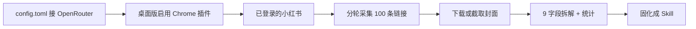

# 用 Codex 接 OpenRouter，自己拆 100 个小红书爆文封面

最近那篇很火的文章说：让 Codex 复盘了 100 个点赞过万的小红书封面，总结出 9 条规律。

规律本身不新鲜。大字、结果前置、数字、表情、高对比、三层信息、手绘、好奇心缺口、把封面当广告。

真正缺的是后半段：

> 这 100 张图是怎么找来的？封面怎么下到本地？分析 Prompt 怎么写，才能复现，而不是看个热闹？

这篇只做实操。

你跟完以后，手里会留下四样东西：

1. Codex 走 OpenRouter 的可用配置
2. 100 条点赞 1 万+ 的图文链接
3. 100 张封面原图
4. 按 9 个字段拆完的复盘表，外加一个以后能直接审封面的 Skill

配套文件在仓库的 `xiaohongshu-cover-lab/` 里，Prompt 都是复制就能用。


## 先把边界说死

这是个人研究，不是爬虫教程。

- 用你自己已经登录的 Chrome，像人一样慢慢搜
- 只看公开图文，不收视频
- 不点赞、不评论、不关注、不私信
- 遇到验证码或风控就停，等你自己处理
- 封面只用于本地复盘，不要把别人的封面当素材二次发布
- 一次搜 12–15 条，分 8 轮凑满 100，不要让 Codex 通宵翻小红书

另外还有一个很容易踩的坑：

**OpenRouter 只替换模型账单。浏览器能力来自 Codex 桌面版的 Chrome 插件。**

小红书网页必须登录。所以采集阶段要用 `@Chrome`，不要用隔离的 `@Browser`。



## 一、你需要准备什么

| 东西 | 作用 | 没有会怎样 |
|------|------|------------|
| ChatGPT 桌面版（含 Codex） | `@Chrome` 操作已登录网页 | 采集走不通 |
| Codex CLI（可选） | 改配置、跑分析、写文件更稳 | 只是少一个入口 |
| OpenRouter 账号和 Key | 模型走第三方，可选视觉更强的模型 | 仍可用官方模型，只是账单不同 |
| 已经登录小红书的 Chrome | 搜索、进笔记、看点赞 | 内置浏览器没有这份登录态 |
| 一个空项目目录 | 放链接、封面、分析 | 文件会散落 |

建议直接用这份目录：

```text
xiaohongshu-cover-lab/
  prompts/
  templates/samples.csv
  templates/analysis-item.md
  skill/SKILL.md
  covers/          ← 运行后出现
  analysis/        ← 运行后出现
```

Windows 配置文件在：

```text
%USERPROFILE%\.codex\config.toml
```

也就是 `C:\Users\你的用户名\.codex\config.toml`。

macOS / Linux 在 `~/.codex/config.toml`。

**provider 必须写在用户级配置里。** 写到项目里的 `.codex/config.toml` 会被 Codex 忽略。

## 二、把 Codex 接到 OpenRouter

OpenRouter 官方现在给了两套写法：CLI 用命令取 Key，桌面版用环境变量。不要混在同一个 provider 块里——官方明确说，`[model_providers.xxx.auth]` 不能和 `env_key` 写在一起。

封面分析要看图。采集阶段用 `@Chrome` 也要会认卡片、标题、点赞。所以模型优先选带视觉的，例如：

- 桌面版常用：`openai/gpt-6-astra`
- CLI 也可用别名：`~openai/gpt-sol-latest`

具体 slug 以 [OpenRouter 模型页](https://openrouter.ai/models) 为准，必须带厂商前缀，不要只写 `gpt-6-astra`。


### 2.1 申请 Key

1. 打开 [openrouter.ai](https://openrouter.ai) 登录
2. 进入 [API Keys](https://openrouter.ai/keys)
3. 新建一把 Key，开头是 `sk-or-`
4. 先充一点点额度，封面视觉分析会比纯文本贵

### 2.2 Windows：系统环境变量

桌面版从开始菜单启动，读不到你在 PowerShell 里 ` $env: ` 的临时变量。要用用户级环境变量，然后彻底退出再打开 Codex。

PowerShell：

```powershell
setx OPENROUTER_API_KEY "sk-or-你的key"
```

关掉所有 Codex / ChatGPT 桌面窗口，必要时在任务管理器里结束残留进程，再重新打开。

验证：

```powershell
echo $env:OPENROUTER_API_KEY
```

如果新开的终端仍是空的，先关掉这个终端再开一个。`setx` 只对之后新启动的进程生效。

### 2.3 桌面版推荐配置（采集 + 看图）

编辑 `%USERPROFILE%\.codex\config.toml`：

```toml
model_provider = "openrouter"
model = "openai/gpt-6-astra"
model_reasoning_effort = "high"

[model_providers.openrouter]
name = "openrouter"
base_url = "https://openrouter.ai/api/v1"
env_key = "OPENROUTER_API_KEY"
wire_api = "responses"
supports_websockets = false
```

这是 OpenRouter 官方桌面版写法。`wire_api` 只能是 `responses`。`supports_websockets` 保持 `false`。

改完后必须重启桌面版。新开一个 Codex 对话，问它：

```text
你当前的 model_provider 和 model 是什么？不要猜，按配置回答。
```

然后去 [OpenRouter Activity](https://openrouter.ai/activity) 看有没有新请求。有请求，才算接通。

### 2.4 CLI 推荐配置（目录刷新更完整）

CLI 更推荐命令取 Key。这样 Codex 会去拉 OpenRouter 的模型目录，非 OpenAI 模型不容易变成 “Unknown model”。

Windows 的 `config.toml`：

```toml
model_provider = "openrouter"
model = "openai/gpt-6-astra"
model_reasoning_effort = "high"

[model_providers.openrouter]
name = "OpenRouter"
base_url = "https://openrouter.ai/api/v1"
wire_api = "responses"

[model_providers.openrouter.auth]
command = "powershell"
args = ["-NoProfile", "-Command", "Write-Output $env:OPENROUTER_API_KEY"]
```

macOS / Linux 把 auth 换成：

```toml
[model_providers.openrouter.auth]
command = "sh"
args = ["-c", "echo $OPENROUTER_API_KEY"]
```

Windows 上没有 `sh`，不要复制 mac 那一段。

启动：

```powershell
cd H:\github\grok-x\xiaohongshu-cover-lab
codex
```

### 2.5 更稳的做法：官方当默认，OpenRouter 当剖面

如果你平时还要用官方 Codex，不要把顶层 `model_provider` 永久改掉。只在用户配置里注册 provider，再用 profile 切换。

`%USERPROFILE%\.codex\config.toml` 只放 provider 块，不写顶层 `model_provider = "openrouter"`。

再新建 `%USERPROFILE%\.codex\openrouter.config.toml`：

```toml
model_provider = "openrouter"
model = "openai/gpt-6-astra"
model_reasoning_effort = "high"
```

用的时候：

```powershell
codex --profile openrouter
```

Codex 0.134 之后，profile 是独立文件，不再写在 `config.toml` 的 `[profiles.xxx]` 里。

### 2.6 配不通时先看这 5 个错

| 现象 | 原因 | 处理 |
|------|------|------|
| 401 / Missing Authentication header | 桌面版读不到 Key | `setx` 后彻底重启；不要只在当前终端 export |
| Unknown model | 用了 `env_key`，没拉目录 | CLI 改成 command auth；或模型 slug 换成 OpenAI 系 |
| 改了配置没变化 | 写到了项目 `.codex/config.toml` | 必须写用户级 `~\.codex\config.toml` |
| 模型 404 | slug 少了厂商前缀 | 用 `openai/gpt-6-astra`，不要写 `gpt-6-astra` |
| 浏览器插件灰掉 | 第三方 Key 不一定覆盖所有官方插件 | 桌面版仍需登录 ChatGPT；采集用 `@Chrome` |

Skills、本地写文件、Chrome 插件走本机。OpenRouter 只负责模型推理。不要指望换一个 Key，Codex 就变成全自动官网。

## 三、采集必须用 @Chrome，不要用 @Browser

Codex 现在有三种“动手”方式，选错就白跑：

| 方式 | 登录态 | 适合 |
|------|--------|------|
| `@Browser` 内置浏览器 | 独立配置，默认不是你日常 Chrome | 本地网页、不需要已有 Cookie 的公开页 |
| `@Chrome` 扩展 | **你正在用的 Chrome，含小红书登录** | 搜笔记、进详情、下封面 |
| `@Computer` 整台电脑 | 最重 | 实在没插件时的退路，不建议一上来就用 |

小红书网页不登录，搜索和点赞都不可靠。内置浏览器就算能现场扫码，也要重新登录一次，风控更敏感。

正确路径：

1. 用你平时刷小红书的那个 Chrome 用户配置
2. 打开 ChatGPT / Codex 桌面版 → Settings → Computer Use
3. 给 Chrome 装官方扩展，直到这里显示 **Manage**
4. 先手动打开 [xiaohongshu.com](https://www.xiaohongshu.com)，确认右上角已登录
5. 新开 Codex 对话，输入 `@Chrome`，允许 `xiaohongshu.com`

授权时选「允许此网站」，不要图省事开「允许所有网站」。


## 四、100 条样本怎么选，比怎么爬更重要

原文章的入选标准可以直接用：

- 点赞 1 万+
- 封面信息完整
- 不是纯靠明星或大 IP
- 能看出标题、构图、配色、情绪

再加三条，否则 100 张会偏科：

1. **只要图文。** 视频封面和图文封面不是同一套点击逻辑。
2. **类目打散。** 生活方式、成长干货、美妆护肤、家居收纳、穿搭、旅游、知识分享、电商种草，每类大约 12–15 条。
3. **先写链接表，再下载图片。** 不要边搜边存图，失败了你会不知道缺哪条。

点赞文案要换算：

| 页面显示 | 计入 |
|----------|------|
| 9999 | 丢弃 |
| 1万 / 1.0万 | 10000，收下 |
| 1.2万 | 12000，收下 |
| 10万+ | 按 100000 记，收下 |

`id` 用笔记 URL 里的那串 ID 去重。同一篇出现在不同搜索词下，只留一条。

## 五、第一段 Prompt：让 Codex 去搜链接

不要对它说「帮我找 100 个爆文」。这句话等于让它自己发明样本。

正确说法是：**一次一个类目，12–15 条，写进 CSV，累计到 100 停。**

完整版在 `xiaohongshu-cover-lab/prompts/01-collect.md`。下面是成长干货这一轮的示例，你只要改「本轮类目」和搜索词。

```text
@Chrome

工作目录：./xiaohongshu-cover-lab
样本表：./templates/samples.csv（追加写入，不要覆盖已有行）

任务：在已经登录的小红书网页版里，采集「图文笔记」封面样本。
这是个人研究，只读不互动。

硬规则：
1. 只用当前 Chrome 登录态。不要新开无痕，不要退出登录。
2. 只收图文，不收视频、直播、商品卡、合集。
3. 点赞数必须 ≥ 10000。把「1万」「1.2万」「10万+」换算成整数后再判断。
4. 封面信息要完整：能看出标题或大字，不是纯明星海报、不是只有脸没有信息。
5. 不要靠明星 / 超大 IP 本身取胜的封面。
6. 不点赞、不收藏、不评论、不关注、不私信。
7. 遇到验证码、风控、登录墙：立刻停，把屏幕状态写进 00_INDEX.md，等我处理。
8. 滚动要慢。每个关键词最多翻 4 屏。两条之间停 2–4 秒。
9. 去重：note_id 已在 samples.csv 里就跳过。
10. 链接必须是当前地址栏可重新打开的完整 URL。如果带 xsec_token / xsec_source，原样保存。
11. 本轮只做「当前类目」，目标 12–15 条有效样本。

本轮类目：成长干货
搜索词按顺序使用，每个词找到 2–4 条就换下一个：
普通女生变好看
30天自律
停止内耗
早起习惯
新号涨粉

操作步骤：
1. 打开 https://www.xiaohongshu.com
2. 确认已登录。未登录就停止。
3. 搜索第一个词，切换到「图文」。
4. 对每张卡片读取：封面大字、点赞数、笔记链接。
5. 打开笔记确认是图文、点赞仍 ≥ 10000、封面可分析。
6. 追加一行到 samples.csv。
7. 本轮结束时更新 ./00_INDEX.md：本轮类目、新增条数、累计条数、失败原因。

完成后只输出：新增 N 条、累计 M 条、被丢弃的原因 Top 3。
```

八轮搜索词可以这样切，避免 100 张全是护肤：

| 轮次 | 类目 | 搜索词 |
|:---:|------|--------|
| 1 | 成长干货 | 普通女生变好看 / 30天自律 / 停止内耗 / 早起习惯 / 新号涨粉 |
| 2 | 家居收纳 | 出租屋改造 / 小房间收纳 / 厨房台面 / 低预算布置 / 房间变清爽 |
| 3 | 美妆护肤 | 皮肤变干净 / 护肤避坑 / 空瓶记 / 敏感肌 / 妆前护肤 |
| 4 | 穿搭 | 显贵穿搭 / 显瘦搭配 / 上班穿搭 / 矮个子 / 基础款 |
| 5 | 生活方式 | 一人食 / 周末在家 / 晨间routine / 打扫房间 / 生活仪式感 |
| 6 | 旅游 | 出片机位 / 小众目的地 / 旅行避坑 / 拍照角度 / citywalk |
| 7 | 知识分享 | 时间管理 / 笔记方法 / 表达训练 / 职场沟通 / 学习方法 |
| 8 | 电商种草 | 平价替代 / 用过才说 / 踩坑 / 真实测评 / 只买这几样 |

每轮结束你都要人工抽查 3 条：链接能不能打开、是不是图文、点赞是不是真过万。Codex 会看错「收藏」和「点赞」，这是正常的。

CSV 表头已经放在 `templates/samples.csv`：

```text
id,note_id,url,title_on_cover,likes_raw,likes,category,cover_file,author,has_face,has_number,skip_reason,collected_at
```


## 六、第二段 Prompt：把封面图落到本地

链接齐了再下载。小红书图片 CDN 经常要登录态和 Referer，直接 `curl` 一张空图很常见。所以 Prompt 里必须写死：**失败就截封面区域，不要死磕接口。**

完整版在 `prompts/02-download.md`。

```text
@Chrome

工作目录：./xiaohongshu-cover-lab
读取：./templates/samples.csv
保存封面到：./covers/
命名：{id}_likes{likes}_{category}_{note_id}.jpg
同时回写 samples.csv 的 cover_file 列。

任务：给每一行还没有封面文件的样本，下载封面图。

规则：
1. 优先从笔记页第一张图 / 卡片封面 img 下载。
2. 请求时带上浏览器里同样的 Cookie 和 Referer（当前笔记页）。
3. 下载失败、403、空白图、小于 20KB：不要死磕接口。改为对封面区域截图，保存为同名 jpg。
4. 不要下载正文里的第 2 张及以后的图。
5. 不要下载头像、二维码、水印条。
6. 每张间隔 2 秒。失败写 skip_reason，继续下一张。
7. 做完输出：成功 N、截图兜底 K、失败列表。
```

验收标准：

- `covers/` 里大约 100 个 jpg
- CSV 的 `cover_file` 都能对上文件名
- 用资源管理器缩略图看，应是封面，不是头像，不是正文长图

缺的那些，单独丢给 Codex：「只补 014、029、077」。不要让它从头再跑 100 次。

## 七、第三段 Prompt：按 9 个字段拆，而不是形容好看

原文章最有用的不是 9 条规律，是拆解方法。单看一张封面，你只会觉得“还行”；100 张写进同一套字段，频率才会出来。

每张封面都要看图。只读 CSV 标题，等于没做视觉复盘。

完整版在 `prompts/03-analyze.md`。单张模板在 `templates/analysis-item.md`。

```text
工作目录：./xiaohongshu-cover-lab
读取 samples.csv 和 covers/ 下的封面图。
逐张分析，每张写 ./analysis/{id}.md。
全部完成后写 ./analysis/_stats.md。

任务：复盘这些爆文封面为什么能让人点进去。不是判断好不好看。

每张封面必须拆 9 个字段：
- 标题结构
- 配色规律
- 字体规律（估计主标题面积占比）
- 人物构图
- 情绪表达
- 图标元素
- 信息密度（第 1/2/3 眼）
- 留白比例
- 点击诱因

再对照 9 条规律打是/否：
1. 大字大约占画面 30% 以上
2. 标题先说结果
3. 出现具体数字
4. 人物表情比产品更能停留
5. 高对比配色，不是高级灰
6. 信息不超过 3 层
7. 有手绘箭头/圈注/贴纸等，且指向重点
8. 制造好奇心缺口，没把答案说完
9. 更像广告位，不像作品集

禁止用“清新”“高级”“好看”当结论。
禁止跳过图片只分析 CSV 标题。
```

100 张不要一轮硬做完。按类目切 8 次，上下文更干净，也更不容易开始胡写。


### 拆完以后，你要看的是频率，不是金句

`analysis/_stats.md` 至少要有这些数字：

- 有效样本数（下载失败的不算）
- 各类目条数
- 9 条规律各自的命中率
- 最常见标题句式 Top 5
- 最常见配色组合 Top 5
- 有人物表情 vs 纯产品
- 主标题面积：不到 20%、20–30%、30% 以上

到这一步，你才有资格说「爆文封面普遍怎样」。没有频率表，就还是观点。

原文章那 9 条，拿来当对照假设，不要当必须证明的结论。你这 100 张如果「数字标题」只有 40%，就如实写 40%，不要为了像那篇文章而改数据。

## 八、9 条规律怎么用在下一张封面上

统计只解决“别人怎样”。做自己的封面时，按这个顺序改，不要一上来换字体。

**1. 先写点击理由，再打开设计工具。**

封面必须先回答：跟我有关吗？我能得到什么？为什么现在要点？

答不出来，再漂亮也只是漂亮地被划走。

**2. 标题先给结果，再给数量。**

少写「我最近尝试了一些护肤方法」。

改成「皮肤变干净后，我才知道这 3 件事有多重要」。

句式可以直接套：

- 结果 + 方法数量
- 变化前后 + 原因
- 痛点解决 + 具体收益
- 反常识，但把关键答案留在正文

**3. 字大到你自己觉得有点吵。**

信息流是扫描，不是阅读。主标题预估要到画面 30% 左右。小了就再放大一档。

**4. 配色不要超过 3 个主色。**

背景色、文字色、一个强调色。绿底白字加荧光黄数字，比奶油灰更抢入口。高级灰可以进作品集，不一定进推荐流。

**5. 信息只留 3 层。**

第一层主标题，第二层数字或结果，第三层箭头或标签。第四层出现就删。

**6. 手绘元素是划重点，不是装饰。**

白色箭头、圈圈、荧光笔，只圈用户该看的地方。圈完全图，等于没圈。

分析阶段如果 Codex 对你自己的旧封面说：

> 画面审美较好，但标题识别成本偏高，结果不够前置，点击诱因弱。

这句话可以翻译成：好看，但不想点。它说对了就改标题，不要改滤镜。

## 九、第四段 Prompt：收成一个能审封面的 Skill

复盘如果只停在文章，下周你又凭感觉做封面。把规则写成 Skill，下次丢一张图进去就能审。

仓库里已经放了一份可直接用的版本：`xiaohongshu-cover-lab/skill/SKILL.md`。

你也可以让 Codex 按你的统计结果改一版，Prompt 在 `prompts/04-make-skill.md`。

放到 Codex 能读到的 skills 目录后，下次只说：

```text
用小红书封面点击复盘 skill，分析这张封面。
```

合格输出必须有：

- 一句结论（想点 / 不想点 / 信息太乱）
- 9 字段
- 9 条规律对照
- 最多 3 条改法，按影响排序
- 3 个下一版标题候选

没有「点击理由」的分析，等于没分析。

## 十、我建议的一天排期

| 时段 | 做什么 | 结束标准 |
|------|--------|----------|
| 30 分钟 | OpenRouter + 重启桌面版 | Activity 里出现请求 |
| 20 分钟 | 装 Chrome 插件，登录小红书 | `@Chrome` 能打开首页 |
| 3–4 小时 | 8 轮采集，中间你抽查 | CSV 满 100 条可打开链接 |
| 1–2 小时 | 下载封面 | covers 目录约 100 张 |
| 2–3 小时 | 分 8 轮视觉分析 | `_stats.md` 有命中率 |
| 20 分钟 | 把 Skill 接到下一次做封面的流程 | 丢一张旧封面能给出改法 |

不要指望一个下午“全自动出一篇爆款复盘”。真正费时间的是抽查和去重。AI 负责翻页和填表，你负责不让垃圾样本进统计。

## 十一、常见问题

**Q：不用 OpenRouter，官方模型能不能做？**

能。这篇接 OpenRouter，是为了换视觉模型和看账单。采集链路的关键是 `@Chrome` + 已登录，不是 Key 从哪来。

**Q：只用 CLI，不用桌面版？**

CLI 适合改配置、写分析文件。操作已登录的小红书，仍然要桌面版 Chrome 插件。不要把 CLI 的沙箱浏览器当成你的 Chrome。

**Q：一次 Prompt 让它找 100 条？**

不要。上下文会糊，滚动会过快，风控会来。12–15 条一轮，是刻意的。

**Q：封面下载全是 403。**

按 Prompt 改成截图封面区域。分析看的是视觉结构，截图够用。不要为了原图去猜签名参数。

**Q：分析到第 40 张开始说空话。**

停。新开对话，只带当前类目的图片和模板。100 张不要塞进一次对话。

**Q：我能不能把别人的爆文封面当模板直接生成？**

不能拿去二次发布。这篇只抽象规律：大字、结果、数字、表情、对比。版式细节属于别人的内容。

## 十二、你现在就可以复制的最短路径

1. `setx OPENROUTER_API_KEY "sk-or-..."`，重启 Codex 桌面版
2. 把第二节的 `config.toml` 写进 `%USERPROFILE%\.codex\config.toml`
3. Chrome 登录小红书，桌面版启用 Chrome 插件
4. 打开 `xiaohongshu-cover-lab/`，按 `prompts/01-collect.md` 跑 8 轮
5. 跑 `prompts/02-download.md`
6. 跑 `prompts/03-analyze.md`
7. 看 `analysis/_stats.md`，再用 `skill/SKILL.md` 审自己的下一张封面

最后回到那句最土、也最有用的检查：

> 用户为什么要点？

这句话答不出来，就还没到打开 Canva 的时候。
